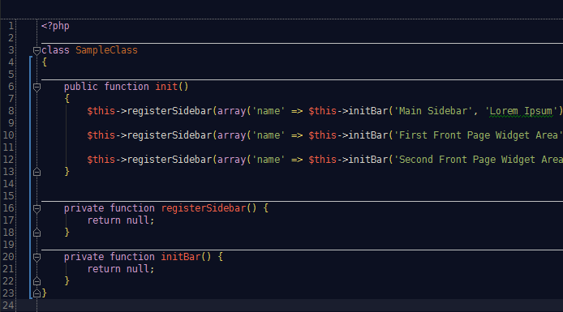

Pastell Color Sheme For PhpStorm
===

## How To Install

### [Download]() the file

_Right Click -> Save As_

### Copy the file to directory

_PHPStorm version 7.x_

* __Ubuntu/Linux__ `~/.WebIde70/config/colors`
* __Mac OS X__ `~/Library/Preferences/WebIde70/colors/`
* __Windows__ `C:/Users/USERNAME/.WebIde70/config/colors`

_PHPStorm version 8.x_

* __Ubuntu/Linux__ `~/.WebIde80/config/colors`
* __Mac OS X__ `~/Library/Preferences/WebIde80/colors/`
* __Windows__ `C:/Users/USERNAME/.WebIde80/config/colors`

### Enable scheme

1. Go to menu: `File` -> `Settings` -> `Editor` -> `Colors & Fonts`
2. Select the cheme name `Pastell` and click OK